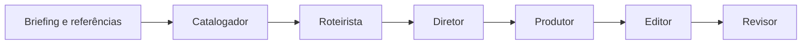

# Portfólio de projetos | Kelton Pereira

Marketing, design e desenvolvimento conectados por dados, integrações e automação.

Crio ferramentas para organizar informações, apoiar decisões e transformar processos em aplicações e experiências digitais. Este portfólio reúne dashboards de KPIs, integrações de sistemas, sites, automação documental e IA aplicada. Arquitetura modular, contratos de dados, testes e segurança da informação fazem parte das decisões técnicas apresentadas nos casos.

[Apresentação no Notion](https://trusting-collard-cb3.notion.site/Portf-lio-Kelton-Pereira-3f2f4f87c8968000af3fd129fd1f7536) · [Perfil GitHub](https://github.com/keltonSC)

## Comece por estes projetos

- **Dados e marketing:** [Dashboard online de KPIs](casos/dashboard-kpis.md), com ingestão, normalização e visualização de indicadores comerciais e de mídia.
- **Arquitetura e IA aplicada:** [Coordenador de seis papéis](demo-agentes/README.md), demonstrador executável com contratos, dependências e 25 testes aprovados.
- **Integrações:** [Catálogo documental e MCP](casos/catalogo-rag-mcp.md), com recuperação textual, proveniência e consultas de leitura.
- **Web e design:** [Sites e landing pages](casos/sites-landing-pages.md), com interfaces responsivas, hierarquia visual e protótipos web.

[Competências e evidências](competencias.md) · [Critérios de segurança](SEGURANCA.md) · [Referências de apresentação](referencias.md)

## Índice completo

| Projeto | Aplicação | Tecnologias | Acesso |
|---|---|---|---|
| Dashboard online de KPIs | Indicadores comerciais, campanhas, CRM e estado das fontes | Python, Pandas, JavaScript, PostgreSQL/Supabase | [Caso e arquitetura](casos/dashboard-kpis.md) |
| Coordenador de seis papéis | Briefings, contratos JSON, dependências e revisão de planos audiovisuais | Node.js, JavaScript, SHA-256, node:test | [Código e exemplo fictício](demo-agentes/README.md) |
| Gerador de PDF | Folhetos com imagens validadas e sem metadados de origem | Python, Streamlit, Pillow, ReportLab | [Ficha](casos/aplicacoes-python.md#gerador-de-pdf) · [Código selecionado](aplicacoes/gerador-pdf/README.md) |
| Casa Boris | Painel de campanhas e leads com uploads isolados por sessão | Python, Streamlit, Pandas, Matplotlib | [Ficha](casos/aplicacoes-python.md#casa-boris) · [Código selecionado](aplicacoes/casa-boris/README.md) |
| Painel de lançamentos | Consulta de exemplos fictícios com filtros e normalização | Python, Streamlit, Pandas, Requests | [Ficha](casos/aplicacoes-python.md#painel-de-lançamentos) · [Versão LCI](aplicacoes/lancamentos-lci/README.md) · [Versão LC](aplicacoes/lancamentos-lc/README.md) |
| Relatório de KPIs | Demonstração pública e separação do acesso operacional | Python, Streamlit, OIDC, Pandas | [Código selecionado e limites](aplicacoes/relatorio-kpis/README.md) |
| Catálogo documental e MCP | Recuperação textual com referências, escopo e validade de snapshots | Node.js, PostgreSQL, SDK MCP, Zod | [Estudo de caso](casos/catalogo-rag-mcp.md) |
| Produção audiovisual e QA | Montagem local e verificação temporal de voz e legendas | Node.js, Python, FFmpeg, NumPy | [Estudo de caso](casos/producao-audiovisual-qa.md) |
| Inbox unificado | Adaptadores de canais, conversas e webhooks | Python, FastAPI, SQLAlchemy, HTML/CSS/JavaScript | [Protótipo](casos/integracao-canais.md) |
| Sites e landing pages | Conteúdo, navegação e interfaces responsivas | HTML, CSS, JavaScript, FastAPI/Jinja2 | [Casos de desenvolvimento web](casos/sites-landing-pages.md) |
| Produtos Primos | Projeto indicado pelo autor; ficha técnica em documentação | A confirmar com a fonte do projeto | [Registro e próximo passo](casos/produtos-primos.md) |

## Competências em contexto

**Integrações e dados:** APIs HTTP, MCP, SQL, preparação de dados, deduplicação e rastreabilidade.

**Marketing e design:** KPIs, campanhas e leads, materiais digitais, storytelling, CTAs, hierarquia visual e interfaces responsivas. Configuração avançada de Meta Ads integra a área de atuação declarada; implementações específicas de mensuração aguardam um case técnico sanitizado.

**Arquitetura de programação:** separação de ingestão, regras, persistência, APIs e interface; contratos, estado versionado e testes de cenários negativos.

**Segurança da informação aplicada:** controle de escopo, menor privilégio, validação de entradas, proteção de informações sensíveis e revisão de riscos. A eficácia dos controles em produção exige verificação própria.

## Demonstrador executável

O [dashboard de KPIs com dados fictícios](demo-kpis/README.md) permite explorar filtros, investimento, leads, CPL e funil sem conexão com CRM ou banco. Todos os registros são inventados; 4 testes verificam cálculos, filtros e entradas hostis. Os aplicativos Python também possuem versões selecionadas com instruções de instalação e testes próprios.

O coordenador de seis papéis acompanha este repositório com exemplo inteiramente fictício. O fluxo passa por catalogador, roteirista, diretor, produtor, editor e revisor. As transições validam a entrada de cada etapa e rejeitam fatos alterados, contexto desatualizado e execução de vídeo inventada.



Requisito: Node.js 22 ou superior. Não há dependências externas a instalar.

```sh
node --test demo-agentes/tests/pipeline.test.mjs
node demo-agentes/pipeline.mjs init demo-agentes/examples/imovel-demo.json
node demo-agentes/pipeline.mjs prompt piloto-local-001
node demo-agentes/pipeline.mjs status piloto-local-001
```

O coordenador trabalha em modo `planning`: recebe respostas JSON preparadas por uma pessoa ou assistente e valida o plano. Não gera automaticamente respostas de IA nem renderiza vídeo. [Leia o fluxo completo](demo-agentes/README.md).

## Verificação e estado

- **Demonstrador:** 25 testes passaram na cópia portátil em 07/10/2026. Os testes cobrem contratos e transições; não medem qualidade criativa.
- **Aplicações Python:** versões selecionadas executadas com dados fictícios e testes de interface, exportação, isolamento de sessões, validação e falhas HTTP. As instruções e limites estão em cada pasta. Dependências fixadas e verificadas; os resultados locais não comprovam atualização das instalações antigas.
- **Catálogo/MCP e audiovisual:** estudos de caso da implementação original. Código operacional e mídia privada não acompanham estas fichas.
- **Dashboard:** demonstração fictícia executável e testada. O ambiente operacional está fora desta vitrine e requer revisão própria de identidade, autorização no servidor e banco antes da ampliação de acesso.
- **Inbox e sites:** protótipos e prévias locais, com limites descritos nas fichas. Não implicam integrações externas ou hospedagem ativa.
- **Produtos Primos:** inclusão solicitada; funções, participação e tecnologias aguardam fonte antes do detalhamento.

Os exemplos deste repositório são fictícios. A apresentação não contém bases de clientes, credenciais, históricos internos ou material de projetos confidenciais. Resultados comerciais e ganhos de tempo não foram medidos nesta preparação. Revisão editorial e técnica: 07/10/2026.
