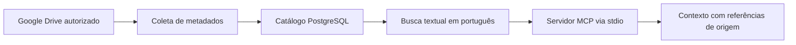

# Catálogo documental com recuperação via MCP

## Problema

Arquivos distribuídos em pastas e subpastas dificultam localizar a fonte correta para um trabalho. Uma resposta precisa indicar de onde veio a informação e distinguir metadados do conteúdo efetivamente examinado.

## Solução desenvolvida

Backend em Node.js para catalogar metadados do Google Drive em PostgreSQL e fornecer ferramentas de consulta por MCP. A recuperação textual em português mantém referências de origem, restrições de escopo e a data do snapshot.

O fluxo prevê paginação, importação idempotente e registro de cobertura. Uma coleta incompleta não deve ser apresentada como catálogo completo. As consultas do MCP usam operações de leitura predefinidas.

## Arquitetura

## Tecnologias

JavaScript, Node.js, PostgreSQL, SDK MCP, Zod, Google Drive API e PGlite em testes locais. Supabase foi usado como infraestrutura na implementação original.

## Estado e limites

Implementação local e integração histórica documentadas no ambiente de trabalho. O acesso remoto e a atualização do catálogo não foram reconfirmados na preparação deste portfólio, em 07/10/2026.

A recuperação é textual; não utiliza embeddings nem interpreta cenas, imagem ou áudio. O catálogo representa um snapshot e não possui sincronização contínua ativada. O backend original atende um operador; uso multiusuário exige revisão da autorização por consulta.

Esta ficha apresenta a arquitetura. Código, bases, IDs de infraestrutura e documentos do ambiente original não acompanham o portfólio.
