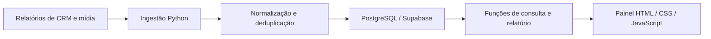

# Dashboard online de KPIs

## Problema

Indicadores de marketing e da operação comercial ficam distribuídos entre CRM, relatórios de mídia e arquivos de importação. A análise precisa reunir essas fontes, manter critérios consistentes e indicar até quando cada conjunto de dados está atualizado.

## Solução

Painel web com visão executiva, tendências, funil, desempenho por equipe e empreendimento, vendas, distribuição de leads e indicadores de mídia. O código contém filtros, comparação de períodos e detalhamento a partir dos indicadores.

A camada de ingestão trata formatos diferentes, normaliza campos e prepara registros para atualização do banco. A interface apresenta o estado das fontes para ajudar a interpretar os indicadores.

## Arquitetura

**Tecnologias observadas:** Python, Pandas, JavaScript, HTML, CSS, PostgreSQL e Supabase. A implementação separa ingestão, persistência, consultas e interface. O código de ingestão contém transformações por tipo de registro, hashes para deduplicação, upsert e registro das cargas.

## Decisões

- Modelar separadamente leads, interações, distribuição, visitas e vendas para relacionar etapas do funil.
- Normalizar os dados antes da carga e identificar registros repetidos para reduzir dupla contagem.
- Apresentar filtros e o estado das fontes junto dos indicadores.
- Usar dados fictícios em apresentações e revisar a autorização do ambiente operacional antes de ampliar o acesso.

Parte das fontes é descrita na documentação como automática; outras dependem de exportação e importação manual. A operação atual dessas integrações precisa de verificação específica.

## Entrega verificada

Em 07/10/2026 foram examinados o código do painel, a ingestão e o esquema de dados. O endereço documentado de hospedagem no Netlify respondeu HTTP 200 a uma consulta de cabeçalhos. O código prevê uma tela de acesso por senha. O ambiente operacional permanece fora dos links de demonstração deste portfólio; uma apresentação aberta deve usar dados fictícios.

Não houve login, consulta de dados comerciais, execução de integrações ou avaliação funcional do painel nesta revisão. HTTP 200 comprova a resposta da hospedagem; não comprova disponibilidade dos dados ou funcionamento de todos os módulos. Código operacional, credenciais e bases não acompanham esta ficha.

## Demonstração pública

A [demonstração de KPIs](../demo-kpis/README.md) usa 12 registros inteiramente inventados. Permite explorar período, produto, equipe, canal e busca, além de investimento, leads, CPL e funil. Quatro testes verificam agregação, combinação de filtros, denominador zero e texto hostil literal.

Não há chamadas de API, senhas, analytics ou conexão com bases operacionais. A interface usa módulos locais e criação de elementos DOM com `textContent`; a política de conteúdo bloqueia conexões externas. O host deve aplicar os cabeçalhos fornecidos para completar a proteção contra incorporação em frames.

Antes de ampliar o uso operacional, validar autorização por usuário/equipe no servidor e banco, limites de consulta e rastreabilidade. Os testes desta demo não certificam a implantação original.
