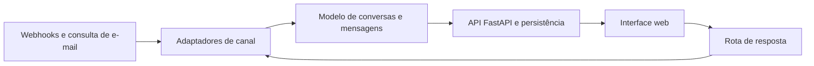

# Integração de canais — protótipo de inbox unificado

## Problema

Conversas distribuídas entre canais exigem interfaces e registros separados. Um protótipo de inbox unificado permite estudar um modelo comum para conversas, mensagens e respostas, mantendo as particularidades de cada canal.

## Solução

Backend e interface web para listar conversas, consultar mensagens e registrar respostas. A implementação contém adaptadores para WhatsApp, Instagram, Messenger e e-mail, webhooks para os canais Meta e consulta periódica de e-mail por IMAP.

O projeto inclui uma carga de demonstração. A documentação descreve um modo sem envio externo quando faltam as credenciais necessárias.

## Arquitetura

**Tecnologias observadas:** Python, FastAPI, SQLAlchemy, SQLite, schemas de API, HTML, CSS, JavaScript e protocolos IMAP/SMTP. A organização contém roteadores, serviços, modelos de dados e módulos por canal.

## Decisões

- Representar conversas e mensagens em um modelo comum.
- Separar os adaptadores por canal para concentrar particularidades de integração.
- Receber eventos por webhook e consultar e-mail por polling.
- Disponibilizar dados de exemplo para explorar a interface sem conectar contas reais.

## Entrega verificada

Em 07/10/2026 foram examinados o README, a organização dos módulos e as rotas de conversas, mensagens, respostas e webhooks. O protótipo não foi executado nesta revisão. Nenhuma mensagem foi enviada e as integrações externas não foram testadas.

A ficha demonstra o desenho e o código de um protótipo. Não certifica permissões Meta, configuração de campanhas, integração ativa com contas ou prontidão para produção. Dados, credenciais e configuração operacional não acompanham o portfólio.

## Próximo passo

Executar a demonstração isolada com dados fictícios e validar os contratos entre os módulos. Antes de conectar canais reais, implementar e verificar autenticação, autorização, validação de assinatura dos webhooks, proteção de segredos, deduplicação de eventos e limites de requisição.
